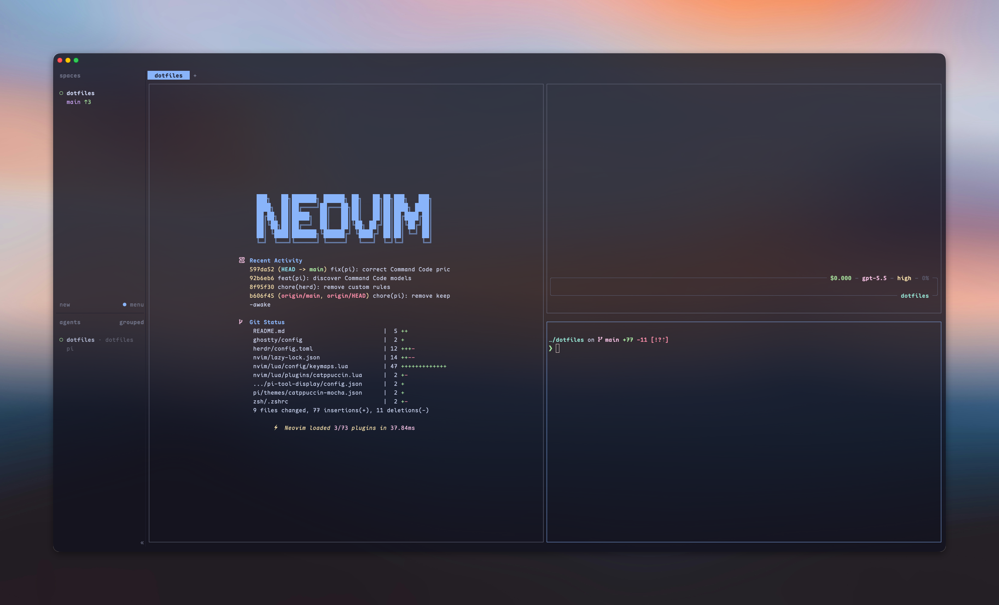

# Dotfiles

My personal configuration for a consistent, fast development environment across machines — shell, editor, terminal, and the daily-driver CLI tools that go with them.

<div align="center">



</div>

## What's included

| Tool | What's configured |
| --- | --- |
| **[Zsh](https://www.zsh.org/)** — interactive shell | `.zshrc` with [zinit](https://github.com/zdharma-continuum/zinit) plugin management, vi-mode, completions, [fzf](https://github.com/junegunn/fzf)/[zoxide](https://github.com/ajeetdsouza/zoxide) integration, and aliases |
| **[Starship](https://starship.rs/)** — cross-shell prompt | Minimal, Nerd-Font prompt theme with language-specific icons and git metrics |
| **[Ghostty](https://ghostty.org/)** — GPU-accelerated terminal | Catppuccin Mocha theme, semi-transparent background, `ctrl+f2` leader keybinds |
| **[WezTerm](https://wezterm.com/)** — GPU-accelerated terminal | Lua config: WebGPU frontend, Maple Mono font, custom Catppuccin scheme, leader-key pane management |
| **[tmux](https://github.com/tmux/tmux)** — terminal multiplexer | TPM plugin manager, Catppuccin status line, session restore, vi copy-mode, smart splits |
| **[Neovim](https://neovim.io/)** — modal editor | Lua config ([lazy.nvim](https://github.com/folke/lazy.nvim)): options, keymaps, LSP, and autocommands |
| **[IdeaVim](https://plugins.jetbrains.com/plugin/164-ideavim)** — Vim emulation for JetBrains IDEs | Vim-style keymaps for LSP navigation, git actions, NERDTree, surround, and easymotion |
| **[VS Code](https://code.visualstudio.com/)** — graphical editor | Per-language formatters, vim-like `hjkl` navigation, and custom-CSS animations |
| **[git](https://git-scm.com/)** — version control | `.gitconfig`: histogram diff, `diff-so-fancy` pager, rebase pulls, `rerere`, and a `~/.gitconfig.local` include |
| **[bat](https://github.com/sharkdp/bat)** — syntax-highlighting pager | Catppuccin Mocha theme with line numbers and change markers |
| **[k9s](https://k9scli.io/)** — Kubernetes terminal UI | Catppuccin skins and command aliases |
| **[lazydocker](https://github.com/jesseduffield/lazydocker)** — Docker terminal UI | Catppuccin theme with Nerd Font icons |
| **[lazygit](https://github.com/jesseduffield/lazygit)** — git terminal UI | `diff-so-fancy` diff rendering, Catppuccin theme, Nerd Font icons |
| **[yazi](https://yazi-rs.github.io/)** — terminal file manager | Custom previewers for Markdown, CSV, JSON, Parquet, and SQLite databases |
| **[topgrade](https://github.com/topgrade-rs/topgrade)** — one-command system upgrade | Curated upgrade list (Rust, Go, Node, Bun, …) plus zinit and pipx/uv custom steps |
| **[posting](https://posting.sh/)** — API client for the terminal | Catppuccin theme and send-on-`f7` keybinding |
| **[AeroSpace](https://github.com/nikitabobko/AeroSpace)** — macOS tiling window manager | Gaps, `alt`-based focus/move/resize keybinds, and automatic per-app workspace routing |
| **[Pi](https://pi.dev/)** — terminal coding agent | Settings for models, themes, and plugin packages |
| **[herdr](https://herdr.dev/)** — terminal workspace & pane manager for coding agents | Catppuccin theme, worktree directory, and `ctrl+hjkl` pane navigation |
| **agent instructions** — guidance for Claude & Gemini | Shared tone, orchestration, and tooling rules for AI coding agents |
| **scripts** — shell utilities | `docx2pdf` / `pptx2pdf`, a detached `runner`, and tmux/herdr focus helpers |

## Setup

```bash
# Clone to home directory
git clone https://github.com/lmilojevicc/dotfiles.git ~/dotfiles
cd ~/dotfiles

# Install all configs
dotty link --all

# Or install specific modules
dotty link scripts zsh git

# Preview changes before linking
dotty link --all --dry-run
```

Configs are managed with [Dotty](https://github.com/lmilojevicc/dotty); see `dotty.toml` for the full link map.
